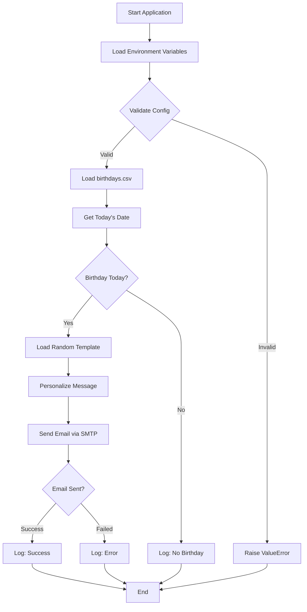
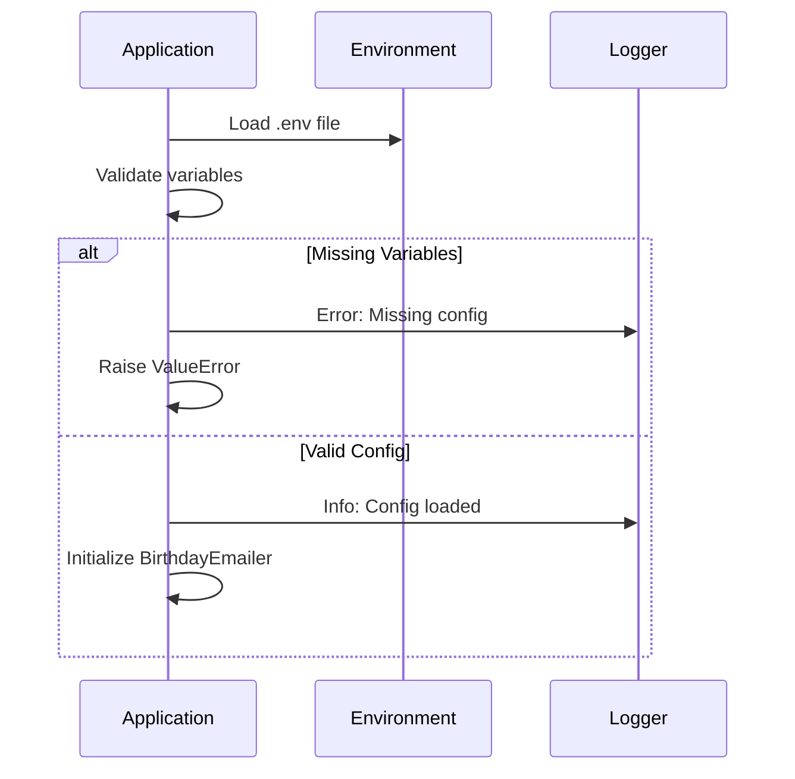
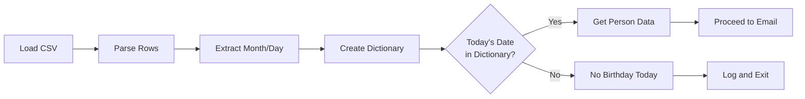
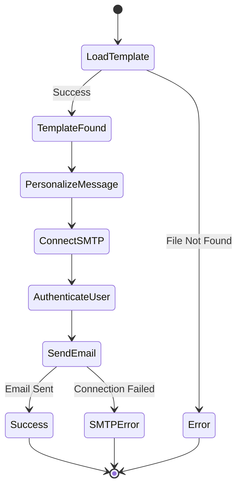
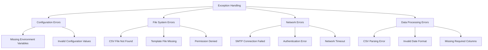

# リファクタリングで改善した主なポイント

## 🔧 **構造的改善**

- **クラス化**: `BirthdayEmailer`クラスで機能をまとめ、再利用可能性を向上
- **メソッド分割**: 各機能を独立したメソッドに分離し、可読性と保守性を向上

## 🛡️ **エラーハンドリング**

- **例外処理**: ファイル読み込み、メール送信などで適切な例外処理を追加
- **バリデーション**: 環境変数の存在チェック
- **ログ機能**: `logging`モジュールで実行状況を可視化

## 💡 **コードの改善**

- **型ヒント**: 関数の引数と戻り値に型を明記
- **定数化**: SMTP設定などを定数として管理
- **パス処理**: `pathlib.Path`を使用してより安全なファイルパス操作

## 🚀 **機能性向上**

- **柔軟な列処理**: CSVの列名に依存しない安全な処理
- **エンコーディング対応**: ファイル読み込み時にUTF-8エンコーディングを明示
- **ログ出力**: 実行状況が把握しやすい

## 📁 **使用方法**

```python
# 従来通りの使用
python birthday_emailer.py

# またはコードから直接使用
emailer = BirthdayEmailer()
emailer.check_and_send_birthday_emails()
```

このリファクタリングにより、コードはより保守しやすく、拡張可能で、エラーに対して堅牢になりました。

## 📊 **図解による視覚的説明**

- **システム全体のフローチャート**: アプリケーションの開始から終了までの処理流れ
- **シーケンス図**: 初期化プロセスの詳細な流れ
- **状態遷移図**: メール生成・送信プロセスの状態変化
- **階層図**: エラーハンドリング戦略の体系的整理

## 🔍 **詳細な処理解析**

- **データフロー分析**: 各処理ステップの入力・出力関係
- **クラス構造表**: メソッドの役割と仕様を表形式で整理
- **パフォーマンス考察**: 時間計算量とメモリ使用量の分析

## 🛡️ **実用的な情報**

- **設定方法**: 環境変数とCSVフォーマットの具体例
- **エラー対処法**: よくある問題と解決策をテーブル形式で整理
- **セキュリティ対策**: データ保護とベストプラクティス

## 📝 **技術的配慮**

- **Mermaid図**: 日本語を避けて英語で記述し、エラーを防止
- **マークダウン構造**: 見出し階層を適切に設定
- **コードブロック**: 設定例とサンプルコードを含む

このREADMEは開発者が迅速に理解・導入できるよう、技術的詳細と実用的な情報をバランス良く配置しています。

Pylanceエラーを修正。問題は`name`変数の型が`Series[Any] | str`になっているため、`str`型を期待する`replace`メソッドに渡せないことです。

## 🔧 **修正内容**

**問題**: `person_data["name"]`の戻り値が`Series[Any] | str`型となり、`str`型を期待する`replace`メソッドに直接渡すことができませんでした。

**解決策**: `str()`でキャストして明示的に文字列型に変換：

```python
# 修正前
name = person_data["name"]  # Series[Any] | str型

# 修正後
name = str(person_data["name"])  # str型
```

## 📝 **型安全性の向上**

この修正により：

- ✅ **Pylanceエラーが解消**
- ✅ **型の一貫性を保証** - `name`変数は常に`str`型
- ✅ **実行時エラーを防止** - `None`や数値が来ても文字列に変換
- ✅ **コードの意図が明確** - 明示的な型変換で可読性向上

これで型チェッカーが満足し、より安全で保守しやすいコードになりました。

## Birthday Emailer 🎂

Automated birthday email sender that checks for birthdays and sends personalized messages.

## Overview

This Python application automatically checks for birthdays from a CSV file and sends personalized birthday emails using Gmail SMTP. The system is designed with robust error handling, logging, and a clean object-oriented structure.

## System Architecture



## Project Structure

```text
birthday-emailer/
├── birthday_emailer.py      # Main application
├── birthdays.csv           # Birthday database
├── letter_templates/       # Email templates
│   ├── letter_1.txt
│   ├── letter_2.txt
│   └── letter_3.txt
├── .env                   # Environment variables
└── README.md             # This file
```

## Features

### 🔧 Core Functionality

- **Automated Birthday Detection**: Checks today's date against CSV database
- **Random Template Selection**: Chooses from multiple email templates
- **Personalized Messages**: Replaces placeholders with recipient names
- **Secure Email Sending**: Uses Gmail SMTP with environment variables

### 🛡️ Robust Error Handling

- Environment variable validation
- File existence checks
- SMTP connection error handling
- CSV parsing error management

### 📊 Comprehensive Logging

- Application startup and shutdown
- Birthday detection results
- Email sending status
- Error reporting with details

## Configuration

### Environment Variables (.env)

```env
TEST_MAIL1=sender@gmail.com      # Sender email address
PASSWORD1=app_password           # Gmail app password
TEST_MAIL2=recipient@gmail.com   # Recipient email address
```

### CSV Format (birthdays.csv)

```csv
name,email,year,month,day
John Doe,john@example.com,1990,12,25
Jane Smith,jane@example.com,1985,6,15
```

**Column Structure:**

- Column 0: Name
- Column 1: Email (optional)
- Column 2: Year (optional)
- Column 3: Month (required)
- Column 4: Day (required)

## Data Flow Analysis

### 1. Initialization Process



### 2. Birthday Check Process



### 3. Email Generation and Sending



## Class Structure

### BirthdayEmailer Class Methods

| Method | Purpose | Input | Output |
|--------|---------|-------|--------|
| `__init__()` | Initialize configuration | None | None |
| `_validate_env_variables()` | Check required env vars | None | Raises ValueError if invalid |
| `load_birthdays()` | Load CSV data | csv_path (str) | Dict[Tuple[int,int], Series] |
| `get_today_tuple()` | Get current date | None | Tuple[int, int] |
| `load_letter_template()` | Load random template | template_dir (str) | Optional[str] |
| `personalize_message()` | Replace placeholders | template, person_data | str |
| `send_email()` | Send via SMTP | subject, message | bool |
| `check_and_send_birthday_emails()` | Main process | None | None |

## Error Handling Strategy

### Exception Hierarchy



### Logging Levels

| Level | Usage | Example |
|-------|-------|---------|
| `INFO` | Normal operation | "3 birthday records loaded" |
| `WARNING` | Non-critical issues | "Row 5 has incomplete data" |
| `ERROR` | Operation failures | "Failed to send email: SMTP error" |

## Installation & Usage

### Prerequisites

```bash
pip install pandas python-dotenv
```

### Setup

1. Clone repository
2. Create `.env` file with required variables
3. Prepare `birthdays.csv` with birthday data
4. Create template files in `letter_templates/`

### Execution

```bash
python birthday_emailer.py
```

### Integration Options

```python
# Direct usage in other scripts
from birthday_emailer import BirthdayEmailer

emailer = BirthdayEmailer()
emailer.check_and_send_birthday_emails()
```

## Template System

### Template Structure

Templates support placeholder replacement:

```text
Dear [NAME],

Happy Birthday! 🎉
Hope you have a wonderful day!

Best regards,
Birthday Bot
```

### Random Selection Algorithm

```python
template_number = random.randint(1, 3)
template_path = f"letter_templates/letter_{template_number}.txt"
```

## Performance Considerations

### Time Complexity

- CSV Loading: O(n) where n = number of records
- Date Matching: O(1) dictionary lookup
- Template Loading: O(1) file read
- Email Sending: O(1) SMTP operation

### Memory Usage

- Birthday Dictionary: ~100 bytes per record
- Template Content: ~1KB per template
- Minimal memory footprint overall

## Security Features

### Data Protection

- ✅ Environment variables for credentials
- ✅ No hardcoded passwords
- ✅ STARTTLS encryption for SMTP
- ✅ Input validation and sanitization

### Best Practices

- Use Gmail App Passwords (not account password)
- Regularly rotate credentials
- Monitor SMTP usage logs
- Validate all external inputs

## Troubleshooting

### Common Issues

| Issue | Cause | Solution |
|-------|--------|----------|
| "Missing environment variables" | .env not configured | Set TEST_MAIL1, PASSWORD1, TEST_MAIL2 |
| "SMTP authentication failed" | Wrong credentials | Use Gmail App Password |
| "Template file not found" | Missing template files | Create letter_1.txt, letter_2.txt, letter_3.txt |
| "CSV parsing error" | Invalid CSV format | Check column structure |

### Debug Mode

Enable debug logging:

```python
logging.basicConfig(level=logging.DEBUG)
```

## Contributing

1. Fork the repository
2. Create feature branch
3. Add tests for new functionality
4. Update documentation
5. Submit pull request

---

**Note**: This application requires a Gmail account with App Password enabled for SMTP functionality.
