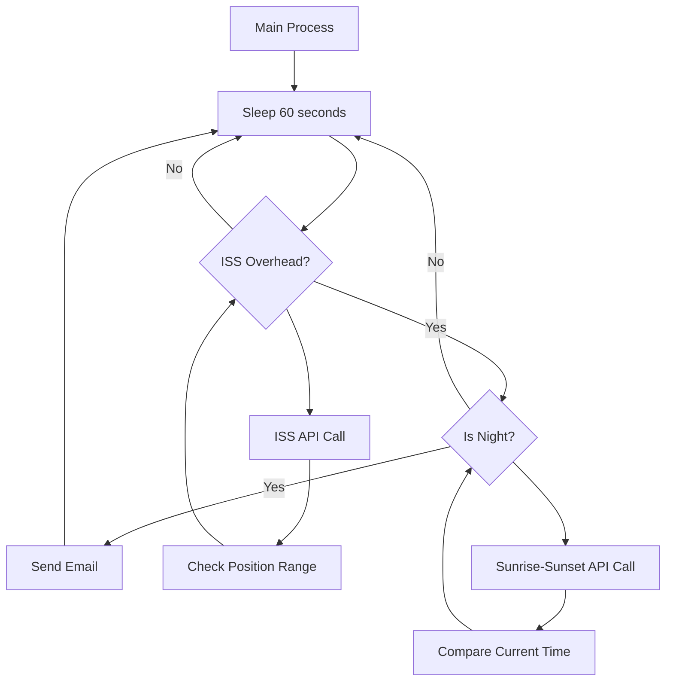
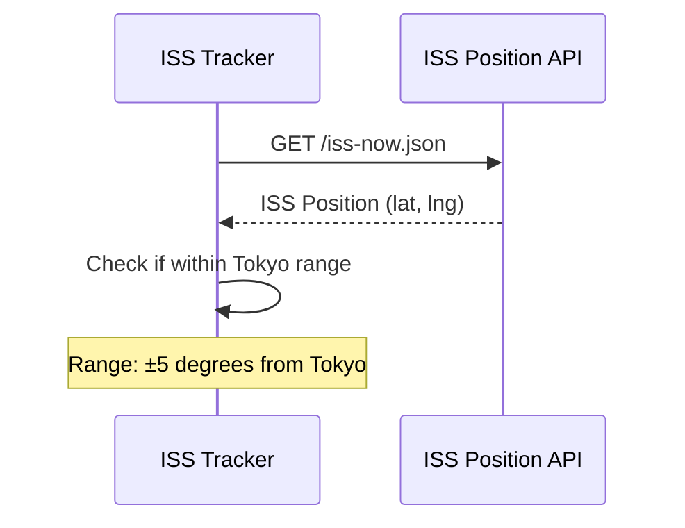
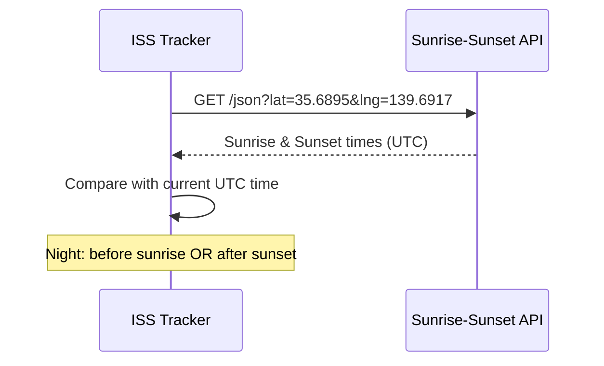
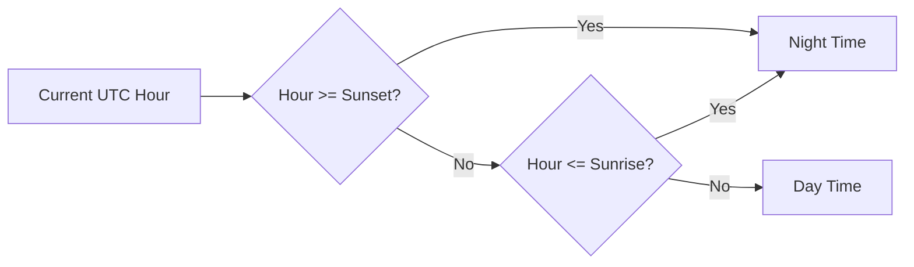
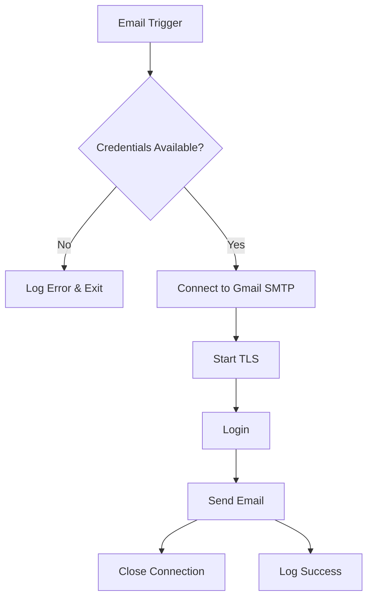
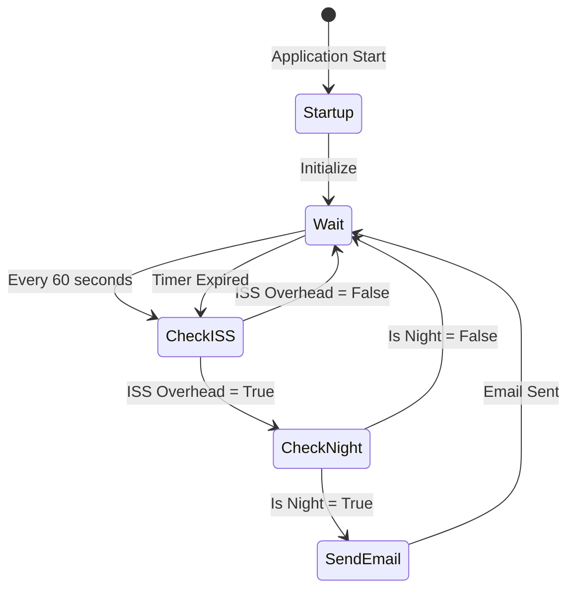
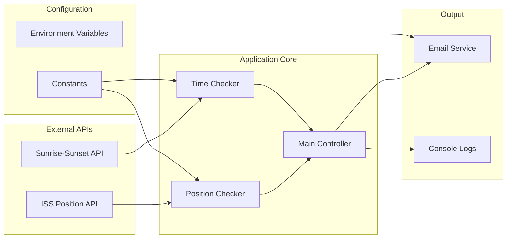

# ISS Tracker 🚀

東京上空のISS（国際宇宙ステーション）を監視し、夜間にISSが頭上を通過するタイミングでメール通知を送信するPythonアプリケーションです。

## 📋 概要

このアプリケーションは以下の機能を提供します：

- ISSの現在位置をリアルタイムで取得
- 東京上空（±5度の範囲）にISSがあるかを判定
- 現在時刻が夜間かどうかを判定
- 条件が満たされた場合にメール通知を送信

## 🔧 システム構成



## 📡 API連携フロー

### 1. ISS位置取得フロー



### 2. 日照判定フロー



## 🌍 位置判定ロジック

ISSが東京上空にあるかの判定条件：

```text
Tokyo Coordinates: (35.6895, 139.6917)
ISS Detection Range: ±5 degrees

Condition:
- (35.6895 - 5) ≤ ISS_latitude ≤ (35.6895 + 5)
- (139.6917 - 5) ≤ ISS_longitude ≤ (139.6917 + 5)
```

### 検出範囲の可視化

```text
    134.69°           144.69°
      |                 |
30.69°+─────────────────+  ← Detection Area
      │      Tokyo      │    (±5° square)
      │       ●         │
40.69°+─────────────────+
      |                 |
```

## ⏰ 夜間判定ロジック



## 📧 メール送信フロー



## 🔄 メインループ処理



## 📊 データフロー



## 🛠️ 環境設定

### 必要な環境変数

```bash
TEST_MAIL1=your_email@gmail.com
PASSWORD1=your_app_password
```

### 依存関係

```python
import os           # 環境変数アクセス
import time         # 処理間隔制御
import smtplib      # メール送信
import requests     # HTTP APIクライアント
from datetime import datetime  # 時刻処理
from dotenv import load_dotenv  # 環境変数読み込み
```

## 🚀 使用方法

1. 環境変数を設定（`.env`ファイル）
2. 必要なパッケージをインストール：`pip install requests python-dotenv`
3. アプリケーションを実行：`python iss_tracker.py`

## ⚙️ 設定可能な定数

| 定数 | 値 | 説明 |
|------|----|----- |
| `TOKYO_LAT` | 35.6895 | 東京の緯度 |
| `TOKYO_LNG` | 139.6917 | 東京の経度 |
| `CHECK_INTERVAL` | 60秒 | チェック間隔 |
| 位置許容範囲 | ±5度 | ISS検出範囲 |

## 🔍 エラーハンドリング

- API接続失敗時：エラーログ出力、処理継続
- メール認証失敗時：エラーログ出力、次回試行まで待機
- タイムアウト設定：各API呼び出しで10秒タイムアウト

## 📈 処理パフォーマンス

- メインループ：60秒間隔
- API応答時間：通常1-3秒
- メール送信時間：通常2-5秒
- メモリ使用量：約15-20MB

---

*Note: このアプリケーションは24時間365日の監視を想定して設計されています。Gmailのアプリパスワードを使用することを推奨します。*

## 主な解析ポイント

1. **システム全体構成** - メインループとAPI連携の流れ
2. **API連携フロー** - ISS位置取得と日照時間判定の詳細な処理
3. **位置判定ロジック** - 東京を中心とした±5度の検出範囲の可視化
4. **夜間判定アルゴリズム** - 日の出・日の入り時刻との比較ロジック
5. **メール送信フロー** - Gmail SMTP接続からメール送信までの手順
6. **データフロー図** - 外部API、アプリケーション、出力の関係性

## 技術的特徴

- **リアルタイム監視**: 60秒間隔での継続監視
- **地理的精度**: ±5度の範囲でISS位置を判定
- **時刻同期**: UTC時間での正確な夜間判定
- **エラーハンドリング**: API障害やメール送信失敗への対応
- **環境変数管理**: セキュアな認証情報の管理

このドキュメントにより、開発者はコードの動作原理と各処理の関係性を視覚的に理解できるようになります。
