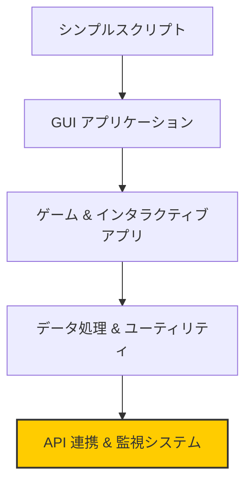
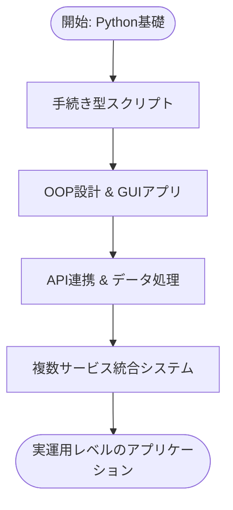

# 概要 (Overview)

このドキュメントは **「Master Python by building 100 projects in 100 days」** リポジトリの包括的な解説を提供します。
このリポジトリは、Python プログラミングの概念を段階的に複雑化するアプリケーションを通じて体系的に学習できるコレクションです。

- 基本的な **Turtle グラフィックス** から始まり、
- **外部サービスとの API 連携システム**、
- **自動通知**、**高度なエラーハンドリング** を備えた実運用レベルのシステムまで含まれています。

---

## 目的と範囲 (Purpose and Scope)

教材は以下の 4 つの主要カテゴリを複雑度順にカバーします。

1. **API 連携・監視システム（最優先）**
2. **デスクトップ GUI アプリケーション**
3. **ゲーム & インタラクティブアプリケーション**
4. **データ処理 & ユーティリティ**

各カテゴリでは異なる Python ライブラリ、デザインパターン、アーキテクチャ手法を紹介し、**手続き型から実運用アプリケーションまで**の進化を示します。

---

## 実装例

- **高度な統合システム**: Spotify プレイリスト作成、Amazon 価格トラッカー、誕生日メール自動送信
- **Web スクレイピング**: BeautifulSoup を用いたフレームワーク
- **API 連携**: Pixela 勉強時間トラッカー、株価・天気監視、フライトディール検索、ISS 追跡通知
- **通信システム**: メール通知システム
- **GUI アプリ**: クイズアプリ、パスワードマネージャー、ポモドーロタイマー
- **ゲーム**: Snake、Pong、Turtle グラフィックスゲーム、Road Crossing
- **データ処理**: CSV 処理、NATO フォネティック変換、ユーティリティアプリ
- **学習用例**: コーヒーマシンシミュレーション

---

## リポジトリ構造と学習進行 (Repository Architecture and Learning Progression)

- 各「Day」フォルダが 1 日分の課題を示す。
- **シンプルなスクリプト** → **外部 API を統合した実運用システム**へと進化。

---

## システムの重要度と複雑性分布

---

## 主要カテゴリ (Core System Categories)

### 🔹 高度な統合システム (Advanced Integration Systems)

- **Spotify Playlist Creator**

  - `BeautifulSoup` で Billboard チャートスクレイピング
  - `spotipy.SpotifyOAuth` で Spotify API 認証
  - 自動プレイリスト生成

- **Amazon Price Tracker**

  - `requests.get` + `BeautifulSoup` で価格取得
  - `smtplib.SMTP()` によるメール通知

- **Advanced Birthday Wisher**

  - `pandas.read_csv()` で誕生日データ管理
  - Gmail SMTP を使った自動送信

---

### 🔹 API 連携・監視システム

- **Pixela 勉強時間トラッカー**: `POST/PUT/DELETE` による API 連携
- **株価 & 天気監視**: Alpha Vantage + NewsAPI + Twilio SMS

---

### 🔹 デスクトップ GUI アプリ

- **Tkinter** によるウィンドウ管理
- **パスワードマネージャー**で実用的な GUI 開発
- セキュアなパスワード生成、JSON 永続化

---

### 🔹 ゲーム & インタラクティブアプリ

- **Turtle Graphics** を基盤とした OOP ゲーム開発
- **衝突判定・スコア管理・レベル進行**

---

### 🔹 通信 & ユーティリティ

- **SMTP 自動メール送信**
- **pandas + CSV データ処理**
- **テンプレートメールの個別化**

---

## 技術スタックと依存関係

| サービスカテゴリ   | API / サービス         | 利用方法                                     |
| ------------------ | ---------------------- | -------------------------------------------- |
| 音楽配信           | Spotify API            | `spotipy.Spotify()` OAuth2                   |
| Web スクレイピング | Billboard, Amazon      | `requests.get` + `BeautifulSoup`             |
| 習慣トラッキング   | Pixela API             | `POST/PUT/DELETE`                            |
| 金融データ         | Alpha Vantage API      | `requests.get`                               |
| ニュース           | NewsAPI                | クエリ付き `requests.get`                    |
| 天気データ         | OpenWeatherMap         | 緯度経度で取得                               |
| 通信               | Gmail SMTP, Twilio SMS | `smtplib.SMTP()`, `Client.messages.create()` |
| 旅行データ         | Amadeus API            | OAuth 認証付き `POST`                        |
| 宇宙データ         | ISS API                | 緯度経度で取得                               |

---

## 学習成果と技術的進展

- **エラーハンドリング進化**: `try-except` → ロギング・カスタム例外
- **設計パターン**: 手続き型 → OOP → 複合的アーキテクチャ
- **型安全性**: 基本アノテーション → ジェネリック型 → Optional
- **テスト & バリデーション**: 入力検証・防御的プログラミング
- **実運用準備**: 環境変数管理・設定ファイル・デプロイ考慮

---

---

✅ 本リポジトリは、**教育的明快さを保ちつつ、実務レベルの Python 開発実践**へと段階的に導きます。
